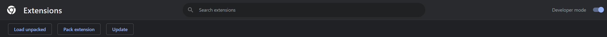

# Fix DuckDuckGo Search Engine Takeover  
**ddg_takeover_fix**  

This tool resolves the issue with the DuckDuckGo Privacy Essentials extension forcing your search engine to DDG.

---

## How to Use  

1. **Clone the Repository**  
   ```bash
   git clone https://github.com/0xSolanaceae/ddg_takeover_fix.git
   cd ddg_takeover_fix
   ```

2. **Run the Script**  
   Execute the script and provide the path to the `manifest.json` file:  
   ```bash
   python ddg_takeover_fix.py
   ```  

---

## Locate the `manifest.json`  

1. Open your browser and go to the **Extensions Page**.  
2. Turn on **Developer Mode** (top-right corner toggle).  

3. Find **DuckDuckGo Privacy Essentials** in the list and click **Details**.  
4. Find the **Extension ID**, which looks like a long string of letters and numbers.   

### Default Extension Locations:  
- **Windows**:  
  `C:\Users\<YourUsername>\AppData\Local\Google\Chrome\User Data\Default\Extensions\<ExtensionID>`  
- **macOS**:  
  `~/Library/Application Support/Google/Chrome/Default/Extensions/<ExtensionID>`  
- **Linux**:  
  `~/.config/google-chrome/Default/Extensions/<ExtensionID>`  

Inside this folder, locate the `manifest.json` file.

---

## Final Steps  

1. Return to the **Extensions Page** and enable **Developer Mode**.  
2. Click **Load Unpacked** and select the folder containing the fixed extension.  